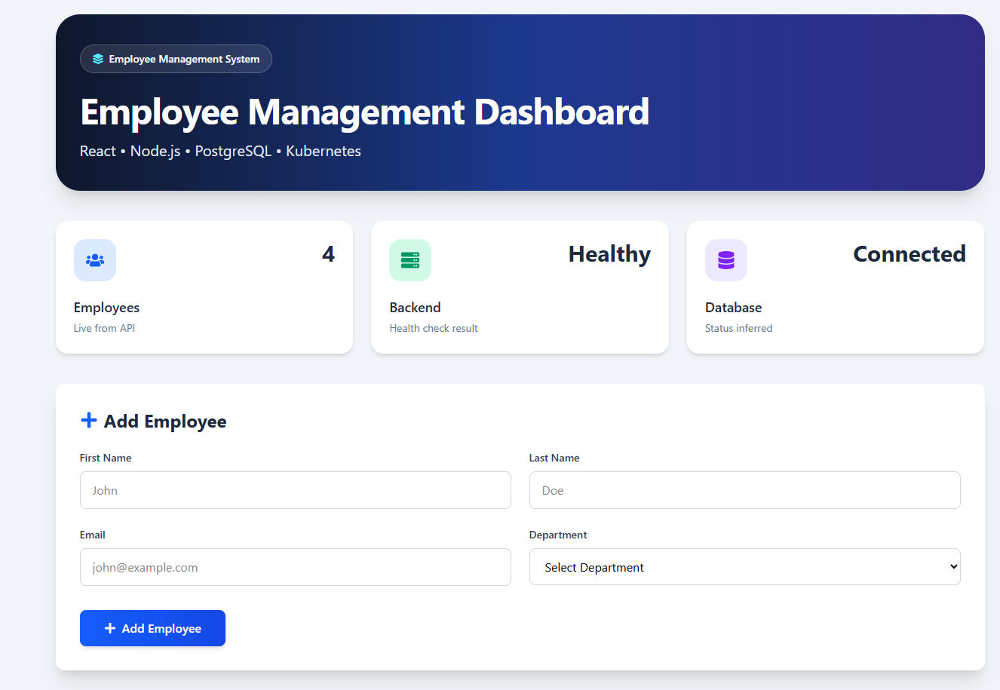
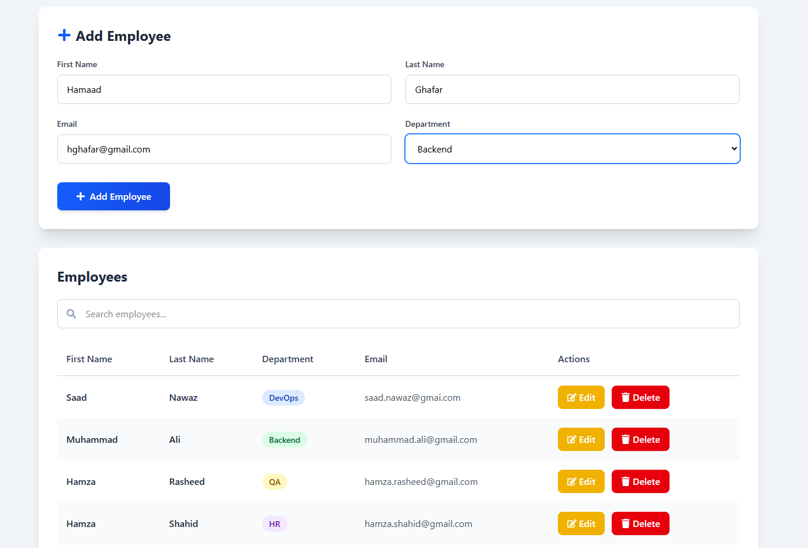
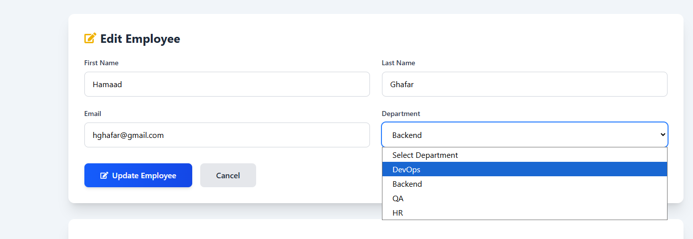
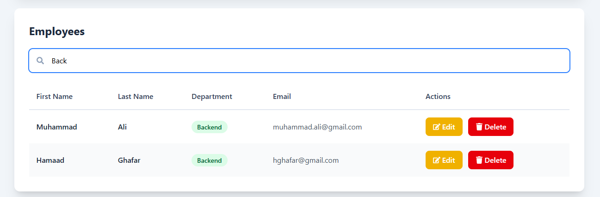

# 🚀 Employee Management System on Kubernetes

A production-style full-stack Employee Management application deployed on Kubernetes using **React**, **Node.js**, **PostgreSQL**, **Docker**, and **Kind**.

The goal of this project is to learn Kubernetes by deploying a real-world application instead of isolated examples. It demonstrates application deployment, networking, persistent storage, configuration management, health checks, ingress routing, and automatic scaling.

---

# ✨ Features

- Employee CRUD operations
- React frontend (Vite)
- Node.js + Express backend
- PostgreSQL database
- Persistent database storage using PVC
- Kubernetes Deployments
- PostgreSQL StatefulSet
- ClusterIP & Headless Services
- ConfigMaps & Secrets
- Init Containers
- Liveness & Readiness Probes
- NGINX Ingress Controller
- Horizontal Pod Autoscaler (HPA)
- Dockerized applications

---

# 🛠 Tech Stack

## Frontend

- React
- Vite
- Tailwind CSS
- Axios

## Backend

- Node.js
- Express
- PostgreSQL

## DevOps

- Docker
- Kubernetes (Kind)
- kubectl
- NGINX Ingress Controller
- Metrics Server

---

# 🏗 Architecture

```text
                     Browser
                        │
                        ▼
                 NGINX Ingress
                  /         \
                 ▼           ▼
      Frontend Service   Backend Service
             │                 │
             ▼                 ▼
      Frontend Pods      Backend Pods (HPA)
                               │
                               ▼
                   PostgreSQL ClusterIP Service
                               │
                               ▼
                    PostgreSQL StatefulSet
                               │
                               ▼
                   Persistent Volume Claim
```

---

# 📸 Screenshots

### Dashboard



### Employee List



### Edit Employee



### Search Employee



---

# 🚀 Running the Project

## 1. Create Kind Cluster

```bash
kind delete cluster --name cka

kind create cluster --config kind-config.yaml --name cka
```

---

## 2. Install NGINX Ingress Controller

```bash
kubectl apply -f https://raw.githubusercontent.com/kubernetes/ingress-nginx/main/deploy/static/provider/kind/deploy.yaml

kubectl wait \
  --namespace ingress-nginx \
  --for=condition=Ready pods \
  --selector=app.kubernetes.io/component=controller \
  --timeout=300s
```

---

## 3. Build Docker Images

```bash
docker build -t employee-frontend:v1 ./frontend

docker build -t employee-backend:v1 ./backend
```

---

## 4. Load Images into Kind

```bash
kind load docker-image employee-frontend:v1 --name cka

kind load docker-image employee-backend:v1 --name cka
```

---

## 5. Deploy Kubernetes Resources

```bash
kubectl apply -f namespace.yaml

kubectl apply -f kubernetes/postgres/

kubectl apply -f kubernetes/backend/

kubectl apply -f kubernetes/frontend/

kubectl apply -f kubernetes/ingress/
```

---

## 6. Install Metrics Server

```bash
kubectl apply -f https://github.com/kubernetes-sigs/metrics-server/releases/latest/download/components.yaml
```

For Kind clusters, edit the Metrics Server deployment:

```bash
kubectl edit deployment metrics-server -n kube-system
```

Add the following argument under the container args:

```yaml
- --kubelet-insecure-tls
```

Verify that Metrics Server is working:

```bash
kubectl top nodes

kubectl top pods -n devops-demo
```

---

# 📚 Kubernetes Concepts Demonstrated

- Namespaces
- Pods
- ReplicaSets
- Deployments
- StatefulSets
- ClusterIP Services
- Headless Services
- ConfigMaps
- Secrets
- Persistent Volumes (PV)
- Persistent Volume Claims (PVC)
- Init Containers
- Resource Requests & Limits
- Liveness Probes
- Readiness Probes
- NGINX Ingress Controller
- Horizontal Pod Autoscaler (HPA)
- Metrics Server

---

# 📈 Autoscaling Demo

The backend is configured with a Horizontal Pod Autoscaler.

When CPU utilization exceeds **70%**, Kubernetes automatically increases the number of backend Pods.

```text
2 Pods
   │
High CPU Usage
   │
   ▼
3 Pods
   │
Still High CPU
   │
   ▼
4 Pods
```

The HPA uses Metrics Server to continuously monitor CPU utilization and scale the Deployment based on demand.

---

# 🔮 Future Improvements

- GitHub Actions CI/CD
- Helm Charts
- Prometheus & Grafana Monitoring
- TLS using cert-manager
- ArgoCD GitOps Deployment
- Network Policies
- Kubernetes Dashboard
- Terraform Infrastructure

---

# 👨‍💻 Author

**Muhammad Saad Nawaz**

DevOps Engineer | AWS Certified Solutions Architect – Associate

---

⭐ If you found this project helpful, feel free to star the repository!